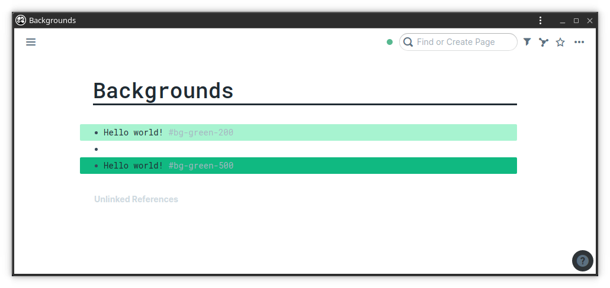
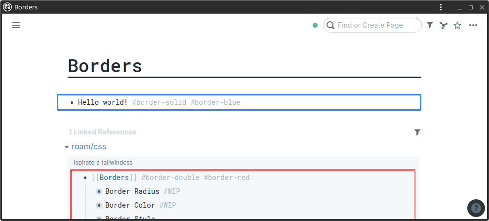
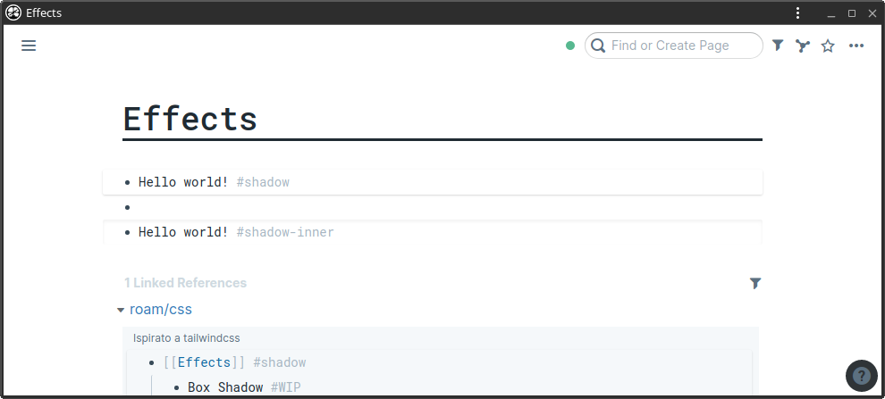

# roam-tailwindcss
Tag-based CSS modifiers inspired by tailwindlabs/tailwindcss

A set of rules to rule your blocks!

## How to use

1. Create a page `roam/css` in your graph
2. Create a code block and change its type to CSS
3. Paste the the contents your like from `main.css` in this repo
4. Apply CSS classes to your blocks using `#tags`

## Available tags

Tags follow the scheme defined by tailwindcss.
Most classes are missing though, as this project in early stage.

### Backgrounds

#### Background Color

* `#bg-green-200` `#bg-green-500`

### Borders

#### Border Radius

* `#rounded-none` `#rounded-full`

#### Border Color

* `#border-black` `#border-blue` `#border-red`

#### Border Style

* `#border-solid` `#border-dashed` `#border-dotted` `#border-double` `#border-none`

### Effects

#### Box Shadow

* `#shadow` `#shadow-inner`
